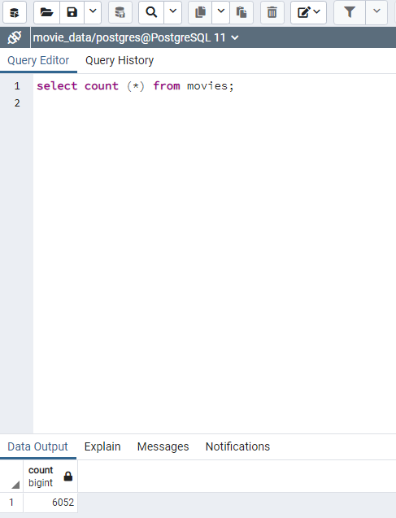
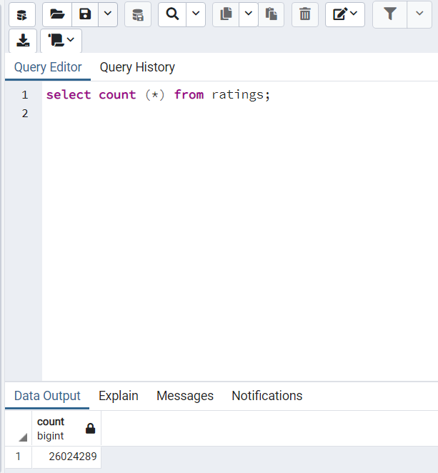

# Movies-ETL (Module 8)

## Overview of Movies-ETL

### Purpose
Refactored code from module to create one function that takes in the three files—Wikipedia data, Kaggle metadata, and the MovieLens rating data—and performs the ETL process by adding the data to a PostgreSQL database.

Deliverable 1: Write an ETL Function to Read Three Data Files

[Link to Jupyter Notebook Deliverable 1 code](ETL_function_test.ipynb)

Deliverable 2: Extract and Transform the Wikipedia Data

[Link to Jupyter Notebook Deliverable 2 code](ETL_clean_wiki_movies.ipynb)

Deliverable 3: Extract and Transform the Kaggle data

[Link to Jupyter Notebook Deliverable 3 code](ETL_clean_kaggle_data.ipynb)

Deliverable 4: Create the Movie Database

[Link to Jupyter Notebook Deliverable 4 code](ETL_create_database.ipynb)

### Resources

This project was prepared using the following:
* Python 3.7.6
* Anaconda 4.12.0
* Jupyter Notebook 6.4.5
* PostgreSQL version 11.15-2
* pgAmdin 4 version 6.7
